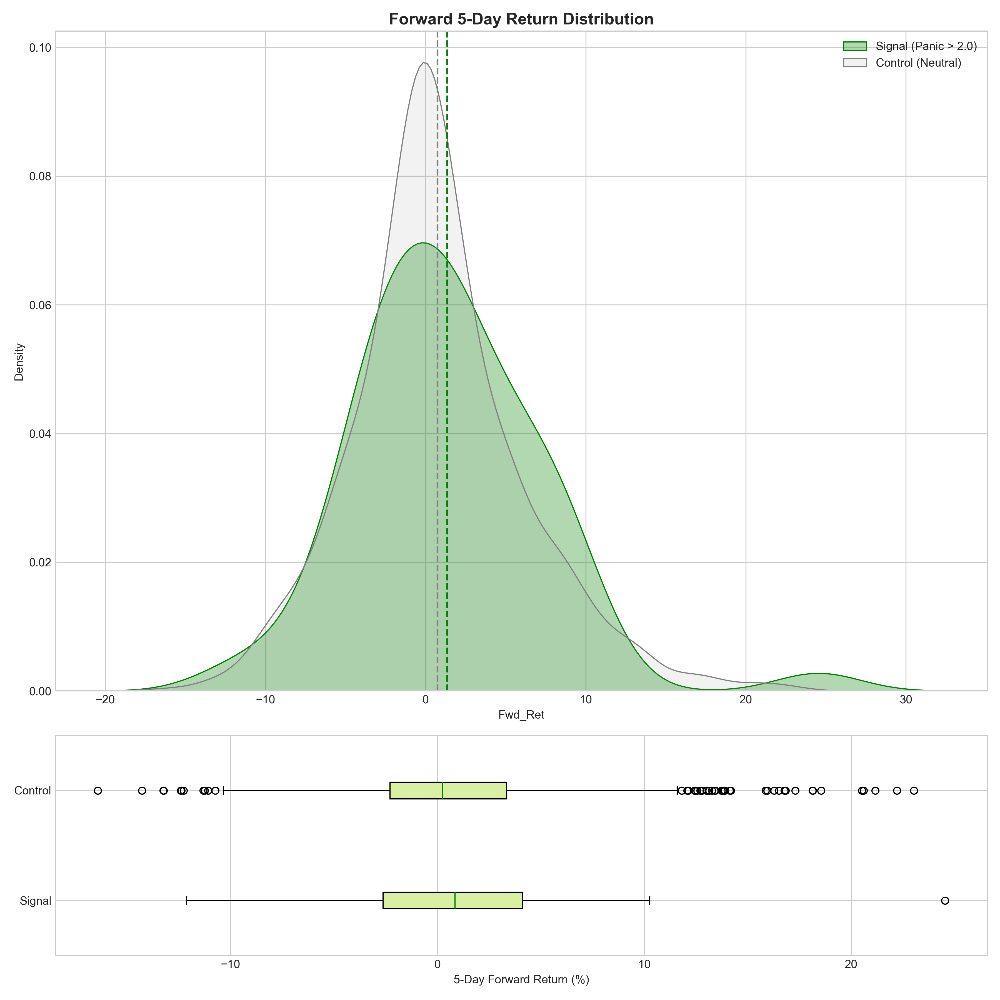
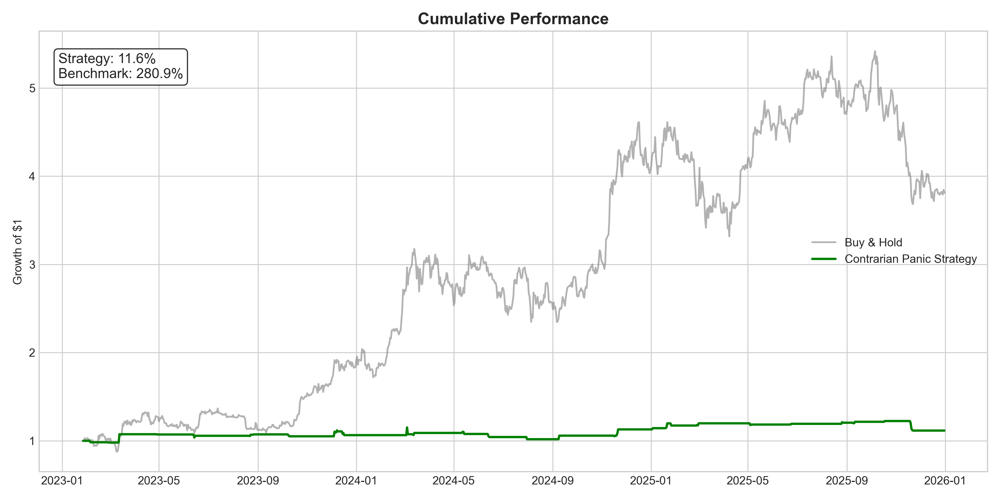

# Crypto Market Panic Detection using Reddit Sentiment: Event Study & Contrarian Strategy Evaluation (2023–2025)
**Status:** Completed (Descriptive Analysis & Strategy Backtest)

**Version:** 1.0.0

## 1. Abstract

This research investigates the predictive utility of retail social sentiment (Reddit) on Bitcoin price crashes. Utilizing a fine-tuned DistilRoBERTa model on comments, I constructed a Panic Index to test hypotheses regarding market efficiency and behavioral finance.

**Key Findings:**

1. **Lag Effect:** Retail sentiment exhibits a 5-day lag relative to price crashes, supporting the "Reactionary" hypothesis over "Predictive" foresight.
2. **Statistical Significance:** A Bootstrap Event Study reveals that pre-crash sentiment slope is not statistically distinct from random noise.
3. **Strategy Performance:** A "Buy-the-Panic" contrarian strategy yielded +11.6% vs +280.9% (Buy & Hold). The strategy successfully functioned as a Risk Filter but suffered from high opportunity cost during the 2023 – 2024 bull run.


## 2. Research Questions

In the absence of traditional valuation frameworks, cryptocurrency markets are often driven by social sentiment. This project aims to answer:

* Does extreme "FUD" (Fear, Uncertainty, Doubt) serve as a leading indicator for liquidity cascades?
* Can a volatility-adjusted sentiment signal generate alpha via mean-reversion trading?


## 3. Data Description & Exploratory Analysis

* **Asset:** Bitcoin (BTC/USD)
* **Sources:** Coingecko (Price) & Reddit r/Bitcoin, r/CryptoCurrency (Sentiment).
* **Dataset Size:** ~330,000 aggregated comments aligned with daily OHLCV data.

### Exploratory Data Analysis

Before constructing the composite index, I validated raw sentiment feeds against price action. As shown below, spikes in raw 'FUD' and 'Anger' intuitively align with local price bottoms, justifying their inclusion in the model.


*> **Figure 1:** Raw Sentiment Intensity (FUD/Anger) vs. Bitcoin Price. Note the visual correlation between sentiment spikes and price drawdowns.*


## 4. Methodology: The Panic Index

I employ Rolling Z-Score Normalization to account for changing market regimes.

1. **Sentiment Scoring:** BERT-based classification (Euphoria, FUD, Anger).
2. **Panic Index Construction:**
$$PanicIndex_{t} = \frac{(FUD_{t} + Anger_{t}) - \mu_{30d}}{\sigma_{30d}}$$
3. **Regime Definition:**
* **Panic:** Index > 2.0 (Extreme Fear)
* **Euphoria:** Net Sentiment > 80th Percentile

## 5. Empirical Results

### A. Market Microstructure & Regimes

I mapped the detected regimes onto the logarithmic price path. The model successfully identifies high-stress periods (Red Zones), and the Contrarian Signal (Green Triangles) consistently triggers near local bottoms.


*> **Figure 2:** Bitcoin Price (Log Scale) with Panic Regimes (Red) and Contrarian Buy Signals (Green). The signals effectively catch "falling knives" but are rare.*

### B. Event Study (Hypothesis Testing)

To validate if the signal is predictive, I conducted a Bootstrap Event Study comparing Crash Trajectories (Red) against a Random Control Group (Grey).


*> **Figure 3:** The Event Study. The Crash Path (Red) falls within the 95% Confidence Interval of the Random Baseline (Grey) before. This indicates that pre-crash sentiment is not statistically distinguishable from noise. I fail to reject the Null Hypothesis.*

### C. Forward Return Distribution

I analyzed the 5-day forward returns following a Panic Signal vs. Neutral days.


*> **Figure 4:** Forward Return Distribution. The Signal distribution (Green) is shifted slightly right (positive mean), confirming a mean-reversion effect. However, the large overlap with the Control distribution explains the high p-value-the signal is profitable on average but noisy.*

## 6. Strategy Performance (Backtest)

A simple logic-based backtest was performed:

* **Signal:** `Panic_Index` > 2.0
* **Action:** Long BTC for 1 Day.
* **Benchmark:** Buy & Hold.


*> **Figure 5:** Cumulative Equity Curve. The Strategy (Green) remains flat (+11.6%) while the Market (Grey) rallies (+280%). This highlights the Opportunity Cost of a "Panic-Only" system in a Bull Market.*

### Why did it underperform?

The underperformance is explained by the Regime Frequency. The market was in a "Panic" state only 5.0% of the time. The strategy sat in cash for 95% of the rally.


*> **Figure 6:** Market Regime Frequency. The rarity of "Panic" events limits the strategy's participation rate.*


## 7. Conclusion & Future Work

**Strategic Conclusion:**
The 'Panic-Only' Contrarian strategy is an excellent Risk Management tool (avoiding drawdowns) but a poor Alpha Generation tool in a momentum-driven market. Future work should focus on:

1. **Hybrid Approach:** Using Panic signals to *exit* positions rather than *enter* them.
2. **Euphoria Signals:** Incorporating "Greed" metrics to capture upside momentum.
3. **Cross-Asset Validation:** Testing on ETH or Altcoins for higher volatility sensitivity.

---

## 8. Installation & Usage

**Prerequisites:**

```bash
pip install pandas numpy torch transformers tqdm matplotlib seaborn scipy

```

**Execution:**

1. **ETL (once):** Process raw text into signals.
```bash
python -m src.preprocessing

```

2. **Analysis:** Execute stats, backtests, and report generation.
```bash
python main.py

```


---

**Reproducibility Note:** Random seed set to **42** in `config.py` for deterministic Bootstrap results.

